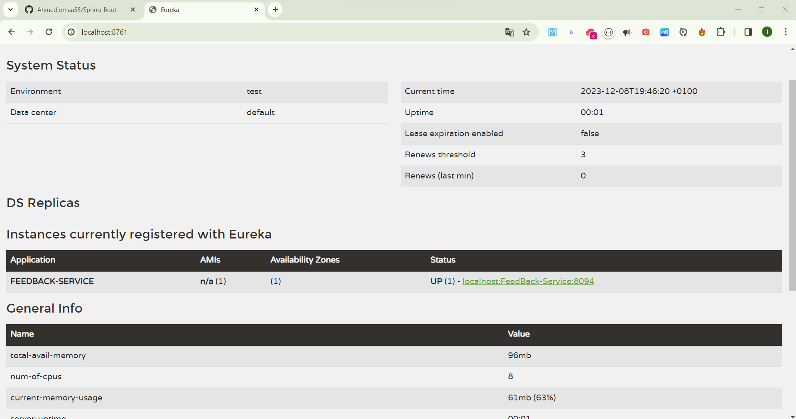

# Documentation du Projet Microservices avec Spring Boot

## Vue d'Ensemble
Ce document décrit la configuration et les fonctionnalités du projet de microservices avec Spring Boot, y compris le client Eureka et la passerelle API (API Gateway), pour notre projet microservice 4 TWIN 6.

### Configuration du Client Eureka

Le client Eureka est configuré pour enregistrer des services afin qu'ils puissent être découverts. Ci-dessous, le statut des instances enregistrées :

- Le service `FEEDBACK-SERVICE` est enregistré et actuellement actif (UP).

    

## Passerelle API (API Gateway)

La passerelle API sert d'intermédiaire qui traite les requêtes provenant du front end et les transmet au back end.

### Fonctionnalités

1. **Restriction d'accès** : La passerelle API est configurée pour restreindre l'accès aux utilisateurs depuis Israël.

    ```java
    // Exemple de configuration du filtre dans la passerelle API
    if (countryName != null && countryName.equals("IL")) {
        throw new ResponseStatusException(HttpStatus.FORBIDDEN, "Pays Non Autorisé");
    }
    ```

    
    

2. **Configuration du Port** : Pour gérer les changements de port dynamiques, la passerelle API est utilisée pour centraliser le traitement des requêtes.

    - Test des requêtes GET et POST sur le port 9000 en utilisant Postman via la passerelle API.

    

## Enregistrement et Découverte de Service

Les microservices sont enregistrés auprès de Eureka, et le statut des instances est affiché sur le tableau de bord.

- Tableau de bord Eureka indiquant le statut des services.

    

## Tests

Le filtre de la passerelle API a été ajouté pour restreindre l'accès en fonction du code pays dans l'en-tête de la requête. La fonctionnalité du filtre a été testée et confirmée comme étant correcte.

- Logique de filtrage dans la passerelle API pour restreindre l'accès.

    

- Résultats des tests du filtre avec Postman.

    

## Monitoring avec Spring Boot Admin

### Ajout de la Dépendance Spring Boot Admin

Intégration de Spring Boot Admin pour le monitoring et la gestion des microservices.

- Ajout de la dépendance dans le fichier `pom.xml` du serveur admin :

    ```xml
    <dependencies>
        <dependency>
            <groupId>de.codecentric</groupId>
            <artifactId>spring-boot-admin-starter-server</artifactId>
            <version>${spring-boot.admin.version}</version>
        </dependency>
    </dependencies>
    ```

    

### Gestion des Dépendances

Configuration de la version de Spring Boot Admin à utiliser dans la section `dependencyManagement` du `pom.xml` :

- Extrait de la gestion des dépendances :

    ```xml
    <dependencyManagement>
        <dependencies>
            <dependency>
                <groupId>de.codecentric</groupId>
                <artifactId>spring-boot-admin-starter-server</artifactId>
                <version>${spring-boot-admin.version}</version>
                <type>pom</type>
                <scope>import</scope>
            </dependency>
        </dependencies>
    </dependencyManagement>
    ```

    

### Activation du Serveur Admin

Activation du serveur admin pour surveiller et gérer les applications Spring Boot :

- Annotation dans la classe principale de l'application admin :

    ```java
    @SpringBootApplication
    @EnableAdminServer
    public class AdminserverApplication {
        public static void main(String[] args) {
            SpringApplication.run(AdminserverApplication.class, args);
        }
    }
    ```

    

### Configuration de l'Admin Server

Configuration du serveur admin pour exposer les endpoints et détailler l'état de santé des services :

- Contenu du fichier `application.properties` du serveur admin :

    ```properties
    server.port=8888
    management.endpoints.web.exposure.include=*
    management.endpoint.health.show-details=always
    ```

    

### Test du Serveur Web Admin

Vérification du fonctionnement du serveur admin via le tableau de bord accessible sur le port configuré :

- Tableau de bord de Spring Boot Admin :

    

### Configuration du Client

Configuration du microservice client pour s'enregistrer auprès du serveur admin via le fichier `application.properties` :

- Paramètres ajoutés au fichier de configuration du client :

    ```properties
    spring.boot.admin.client.url=http://localhost:8888
    eureka.client.service-url.defaultZone=http://localhost:8761/eureka/
    server.servlet.context-path=/feedback
    ```

    

### Dépendance Client dans `pom.xml`

Ajout de la dépendance client admin dans le fichier `pom.xml` du microservice client pour permettre l'enregistrement auprès du serveur admin :

- Extrait du fichier `pom.xml` du client :

    ```xml
    <dependencies>
        <dependency>
            <groupId>de.codecentric</groupId>
            <artifactId>spring-boot-admin-starter-client</artifactId>
            <version>${spring-boot-admin.version}</version>
        </dependency>
    </dependencies>
    ```

    

### Vérification du Service Client

Confirmation de l'opérationnalité du service client affiché sur le tableau de bord de Spring Boot Admin :

- Service client enregistré et fonctionnel :

    


Très bien, je vais intégrer les nouvelles informations sur Docker et Kubernetes dans la structure de votre documentation en Markdown.

```markdown


## Docker et Kubernetes

### Docker Compose

Utilisation de Docker Compose pour orchestrer le déploiement des services microservices :

```plaintext
docker-compose up
```

L'exécution de cette commande lance tous les services définis dans le fichier `docker-compose.yml`.


### Installation du Cluster Kubernetes via Docker Desktop

Kubernetes est utilisé pour gérer les déploiements dans un environnement de production. Docker Desktop inclut une fonctionnalité pour installer et configurer un cluster Kubernetes local :


### Test avec Kubectl

La commande `kubectl` est un outil en ligne de commande pour interagir avec le cluster Kubernetes. Voici comment vérifier l'état des nœuds du cluster :

```bash
kubectl get nodes
```


### Installation de Lens pour Kubernetes

Lens offre une interface utilisateur graphique pour gérer et observer les ressources Kubernetes, rendant la gestion des clusters plus intuitive :


### Vérification des Services avec Kubectl

Pour lister tous les services dans le cluster et vérifier leur état :

```bash
kubectl get services
```


### Docker Hub et Gestion des Images

#### Connexion à Docker Hub

Connexion au registre d'images Docker pour pouvoir pousser et tirer des images :

```bash
docker login
```


#### Push des Images sur Docker Hub

Après avoir construit et tagué les images localement, elles sont poussées sur Docker Hub pour le partage et le déploiement :

```bash
docker push <username>/<repository>:<tag>
```


#### Image Poussée sur Docker Hub

Confirmation que l'image est disponible sur Docker Hub :


#### Push d'une Autre Image (Currency Service)

Poussée de l'image du service de gestion de la monnaie :

```bash
docker push <username>/currency:latest
```


### Déploiement avec Kubernetes

Déploiement de l'application sur le cluster Kubernetes en utilisant l'image Docker précédemment poussée :

```bash
kubectl create deployment feedback-deployment --image=<username>/feedback
```

Cette commande crée un déploiement Kubernetes qui orchestre la création et la gestion des pods basés sur l'image spécifiée.


# Continuation de la Documentation du Projet Microservices

## Docker et Kubernetes

L'orchestration des containers avec Docker Compose et Kubernetes offre une gestion et un déploiement efficaces des services microservices.

### Docker Compose

Utilisation de Docker Compose pour orchestrer le déploiement de multiples services.


### Kubernetes

Installation et configuration du cluster Kubernetes via Docker Desktop.


Vérification du fonctionnement de kubectl et de l'état des noeuds.


Installation et utilisation de Lens, un outil de gestion Kubernetes.


Liste des services et de leurs états via kubectl.


### Intégration avec Docker Hub

Connexion à Docker Hub et poussée des images de containers.


Confirmation de la poussée des images sur Docker Hub.


### Déploiement et Exposition sur Kubernetes

Création de déploiements pour les microservices et exposition des services via kubectl.


Exposition de tous les services avec la commande `kubectl expose`.


Visualisation des services exposés dans Kubernetes.


### Gestion et Mise à l'échelle

Mise à l'échelle des déploiements pour répondre à la demande.


Redémarrage et test des déploiements pour assurer la résilience.


### Tests avec Postman

Utilisation de Postman pour tester les endpoints des microservices.


## Conclusion

Ce projet illustre une architecture microservices robuste et évolutive en utilisant Spring Boot pour le développement, Eureka pour la découverte de services, et une combinaison de Docker et Kubernetes pour l'orchestration des containers. 


```
